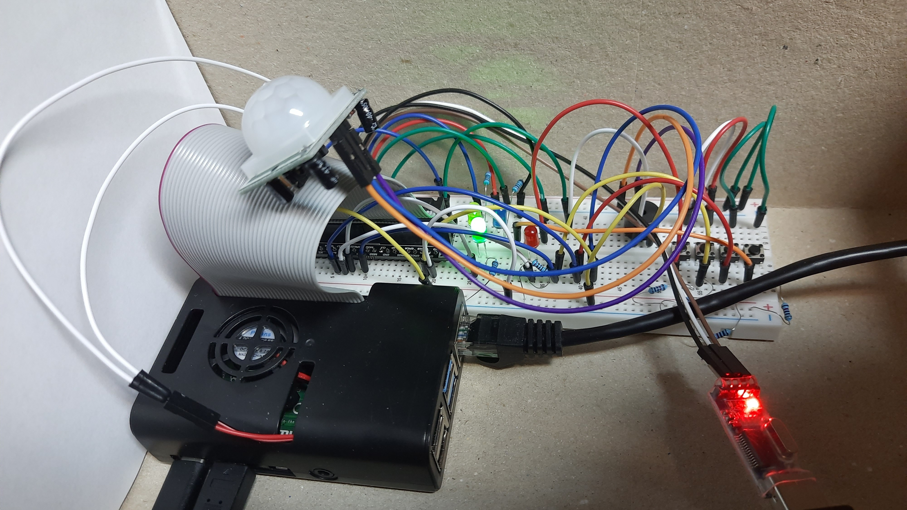

# The Guard on Raspberry Pi 4b

A simple integrated system for alerting of an unauthorized physical intrusion.

Features:
- [ ] Switch to the calm mode by entering a password
- [ ] Report to another device through network

## Required items

- [ ] Raspberry Pi 4b
- [ ] Motion detector (with the single pin for output)
- [ ] Buzzer
- [ ] 4 diodes
- [ ] 4 buttons
- [ ] A PC with Linux system that can run Buildroot
- [ ] At least 8 GiB of free storage
- [ ] A microSD card with at least 1 GiB of storage

GPIO pins 18, 17, 10, 25 are for buttons 1, 2, 3, 4 accordingly, pins 24, 27, 23, 22 are for diodes, the pin 26 is for the motion detector's output and the pin 21 is for the buzzer.

## Installation

- [ ] \(recommended\) Delete <kbd>.git</kbd> directory to prevent the warning of repository embedding.

- [ ] Run <kbd>./rpisecsys.sh</kbd>. This can take a couple of hours on an average PC.

- [ ] Format the RPi SD card with the image <kbd>buildroot/output/images/sdcard.img</kbd>: <kbd>dd if=sdcard.img of=/dev/\<RPi_sdcard\> bs=4096 status=progress && sync</kbd>

- [ ] Mount the first partition of the SD card. For example: <kbd>mkdir /tmp/d</kbd> <kbd>mount /dev/\<RPi_sdcard\>1 /tmp/d</kbd>

- [ ] Copy <kbd>buildroot/output/images/Image</kbd> to the first partition: <kbd>cp Image /tmp/d/Image</kbd> <kbd>sync</kbd>

- [ ] Unmount the partition: <kbd>umount /tmp/d</kbd>

- [ ] Run the RPi and log in with these credentials: <kbd>root</kbd>, <kbd>1234</kbd>. Make sure that the SD card is inserted.

- [ ] Run <kbd>rpi_security_system \<HOST_IP_ADDRESS\></kbd> on the RPi. If you don't care about alert reporting, put a random IP address. Otherwise, run the *server* application on your host to accept reports.

## Usage

Try triggering the motion detector. If you wait too long during the alarm or you fail to enter the password, then the system will try to report the alert to \<HOST_IP_ADDRESS\> port 10000. To prevent this, press the sequence of buttons: <kbd>1 2 3 4 3 2 1</kbd>. Then the system will be in the calm mode. To switch back to the guarding mode, press any button.

There are multiple attempts to enter the password. The next attempt is signaled by another diode being lit up.
